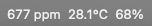

# SensorLens

Your SwitchBot temperature, humidity and CO2 readings in the macOS menu bar.

A menu-bar front end over the [`sensor-lens`](../sensor-lens) CLI, which ships
bundled inside the app. The CLI holds the credentials, talks to the SwitchBot
API and owns the database; this app displays what it collects — and, while it is
running, does the collecting.



## Requirements

- macOS 14+, Apple Silicon
- A SwitchBot hub, and a token and secret from the SwitchBot app
  (Profile → Preferences → tap **App Version** ten times → Developer Options)

## Install

```bash
make build-app        # -> dist/SensorLens.app (signed, CLI bundled)
open dist/SensorLens.app
```

Put the token and secret in `config.toml` — the About tab shows exactly where —
then use **Refresh**. Everything else is discovered from your account.

## Collect the house, show two numbers

The **menu bar** shows up to three readings you pick, per *device × metric* — so
one sensor can contribute only its CO2 while another contributes only its
temperature. Drag them into the order you want them read in; the leftmost is the
one you see without looking. Clicking it opens those same readings with the **last six hours**
behind each one, and a trend arrow.

What is *collected* is a separate, wider choice, and it belongs to the CLI's
`config.toml`. Collect eight sensors, put two on the bar — collecting the house
is what makes the history complete, but reading fifteen cards is not what anyone
wants from a menu-bar click. Every collected sensor is a click further away, in
the History window.

## Who does the collecting

While the app is running it collects, by ticking the CLI's `now --if-stale` —
which polls only when the stored readings have aged past the interval. That
halves the API spend against a daemon running around the clock, because it only
collects while you are actually at the machine.

**Collection → Open SensorLens at login** is worth turning on for the same
reason: while the app runs it *is* the collector, so starting it at login is
what keeps the history from having a hole after every restart.

**Collection → Keep collecting when this app is closed** installs the background
daemon instead. With it on, the app's own tick finds fresh data and costs
nothing, so the two never double-spend and there is nothing to keep in sync.

With it off, whatever happens while the app is closed is simply not recorded —
and the SwitchBot API has no history endpoint, so it cannot be recovered later
except by exporting that window from the SwitchBot app and running
`sensor-lens import`. The History window marks those gaps rather than drawing a
line straight through them.

## The CO2 alert

Settings → Collection → **Warn me about** chooses which sensors may raise a
warning: a bedroom filling up matters, a server rack may not. A sensor switched
off there still shows its reading — it just stops raising the menu-bar glyph and
the notification. New sensors alert until you say otherwise, since a warning
arriving unasked is safer than one missed.

CO2 is the one reading here with an actionable threshold, so it is the only one
tinted. Above the "elevated" threshold (1000 ppm by default) the bar shows an
air-quality glyph; above "high" (1500 ppm) it turns red. Optionally it notifies
— once per room per crossing, not on every reading.

## API usage

The account allows 10,000 calls a day, and going over does not fail loudly: the
API starts answering "Unauthorized", exactly as it would for a wrong token. The
Collection tab shows what has been spent today and what the current schedule
projects, so the number is visible before it becomes a mystery.

## Development

```bash
make build-app   # signed .app with the CLI bundled
make test        # swift test
make package     # notarize + staple + zip
```

Build the CLI first (`make build` in `../sensor-lens`) so `build-app` embeds a
fresh signed binary. See `AGENTS.md` for the layout and the gotchas.

## License

MIT — see `LICENSE`.
